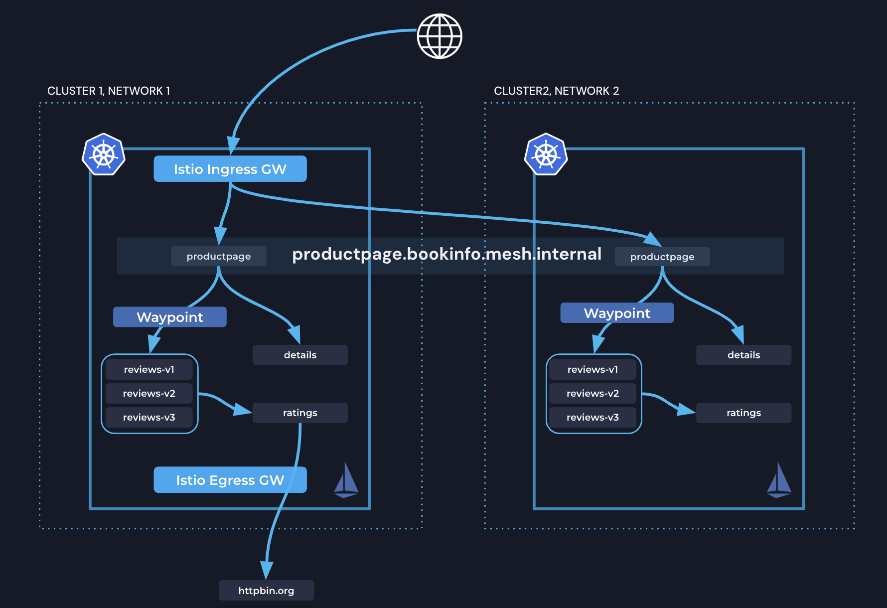

= Solo.io Istio Ambient Multi-cluster Workshop
:source-highlighter: rouge
:toc:

In this workshop, you will set up Istio Ambient in a multi-cluster environment, deploy a sample Bookinfo app, and 
explore how Solo.io Ambient enables secure service-to-service communication in all directions.

Watch the Ambient multi-cluster demo on Youtube!

ifdef::env-github[]
image::https://img.youtube.com/vi/18dpBukOYSk/maxresdefault.jpg[link=https://youtu.be/18dpBukOYSk]
endif::[]

ifndef::env-github[]
video::18dpBukOYSk[youtube]
endif::[]

include::modules/env-prep/env-prep.adoc[]

include::modules/deploy-bookinfo/deploy-bookinfo.adoc[]

include::modules/install-istio/install-istio.adoc[]
